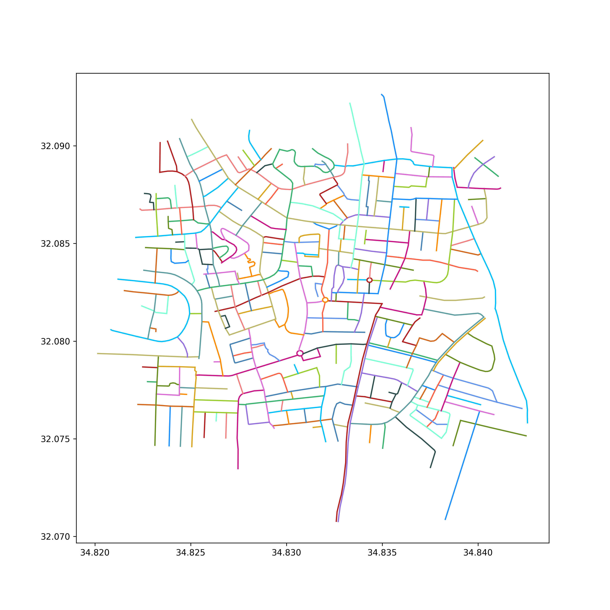

# Task
I was tasked with developing a street colouring algorithm using Python3. The algorithm should color lines in the same color when perceived as a single street.

# Explanation

## Intuition
Out of the sample files we are interested in the `.shp` file primarily (I could work with just it using 'shapefile', but `gpd` needs also `.dbf` and `.shx`).
The task immediately looks like an assignment to color a graph using dfs, but remains to be seen if there's a better solution.
For each multiline end point, if there exist another multiline, it is of the same color (street),
- If only one, then it's the same color
- If more than one, then one of them, specifically, the one with the smallest angle to the current one. Additionally, if the smallest angle (e.g., >45°?), it's a different color. 

## Approach
I used `geopandas` to read and manipulate the shape data. I've added a new row `style` to color them and check visited shapes.
The biggest challenge was ensuring that the algorithm was selecting only one neighbor (done in `identify_street_continuation()`), and that it chose specifically the one that has the smallest angle to the current one (using `angle_between()` with dot product formula, and then returned abs deviation from 180 degrees). I then passed the best candidate for either ends of the current segment to be painted recursively.  
I then utilized `matplotlib` to plot the streets.

## Complexity
Super-worst case for my dfs is O(n^2) if all segments are neighbors of each other. But real-life case should be closer to O(n). All other operations should work either for O(n) or constant time.
However, there are some places that are quite suboptimal (e.g., using `GDF.at()` and `.intersects()`, or checking the same neighboring segments more than once) and could be significantly improved. One idea I'd like to explore is using an R-tree for that.

# Solution example
## Input

## Output - solid lines

## Output - a variety of styles

